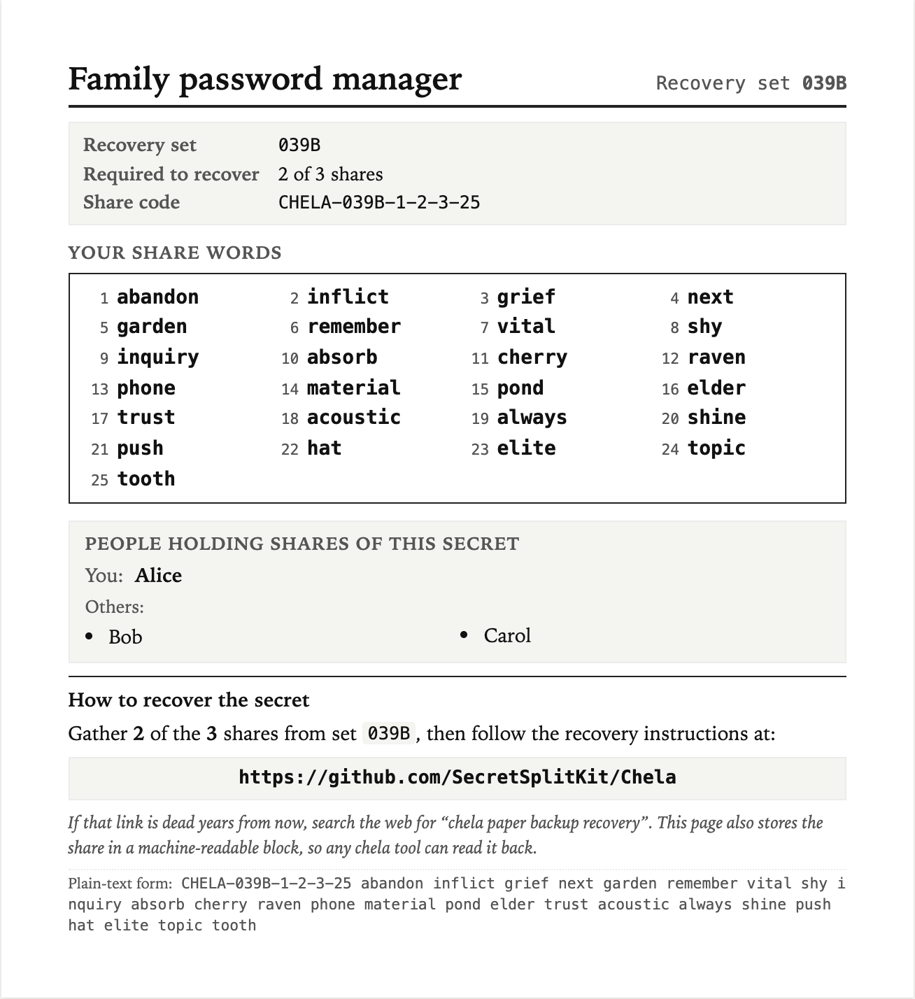

# Recovering a chela backup

This guide is for someone who has been given a chela paper share (or several) and
needs to put them back together to recover a secret - typically a cryptocurrency
wallet seed phrase or a password.

If you arrived here from one of the shares: **take a breath**. Nothing here is urgent.
The shares are the only thing that can recover the secret, and they don't expire.
You can come back to this tomorrow if you need to.

You don't need to install anything. You don't need to know how a computer works
beyond opening a web browser and double-clicking a file. The whole recovery happens
on your own machine, with no internet involved.

## What a chela share looks like

Each printed share has a title at the top, a "Required to recover" line, a
share code like `CHELA-3058-1-3-5-40`, a numbered list of words, and short
recovery instructions printed at the bottom:

(This is a sample - yours will have the real holder's name and the real words on it.)

## Before you start

You'll need:

- **A computer** running Windows, Mac, or Linux, with any modern web browser
  (Chrome, Edge, Firefox, Safari - any will do).
- **The paper shares.** Each share has a *share code* like `CHELA-3058-1-3-5-40` and a
  list of words (anywhere from a handful for a short password to around 28 for a
  24-word seed phrase, depending on what was stored). All shares from one backup have
  the same number of words.
- **A minimum number of shares** - look on the front of the share for *"M of N"*. For
  example, **3 of 5** means you need any 3 shares out of the 5 that were made. If you
  only have 2 of the 5, you can't recover yet - you need a third.

The recovery program reads everything it needs from the **words** themselves. The
share code on the label is a convenience for matching shares up; if a label is smudged
but you can still read the words, you can still recover.

You do *not* need an internet connection during the recovery itself (only to
download the recovery program, once).

---

## Step 1 - Download the recovery program

Open your web browser and go to:

**<https://github.com/SecretSplitKit/Chela/releases/latest>**

This page is GitHub. Scroll down to the section called **Assets** - you'll see a
list of files. Find the one whose name ends with **`-web.html`** (for example
`chela-v1.0.0-web.html`). Click that file's name. Your browser will download it.
**It is just a single file.**

Save it somewhere you'll remember:

- **Windows:** the *Downloads* folder is fine; the *Desktop* is even easier to find.
- **Mac:** *Downloads* or *Desktop*.
- **Linux:** wherever you usually save downloads.

---

## Step 2 - Open the file you just downloaded

### Windows

1. Open **File Explorer** and go to the folder where you saved the file (probably
   *Downloads* or *Desktop*).
2. **Double-click `chela-vX.Y.Z-web.html`**.
3. Your default web browser will open with chela's main screen.

If Windows shows a security warning ("Windows protected your PC"), this is normal
for files downloaded from the internet. Click **More info** → **Run anyway**, or
right-click the file → **Properties** → check **Unblock** → **OK**, then
double-click again.

### Mac

1. Open **Finder** and go to the folder where you saved the file (probably
   *Downloads*).
2. **Double-click `chela-vX.Y.Z-web.html`**.
3. Your default web browser will open with chela's main screen.

If macOS shows a warning that the file is from the internet, click **Open** (or, if
you don't see an Open option, **Cancel** then right-click the file → **Open With** →
your browser of choice).

### Linux

1. Open your file manager and go to the folder where you saved the file.
2. **Double-click `chela-vX.Y.Z-web.html`**, or right-click → **Open With** →
   choose your browser.

---

## Step 3 - Click "Recover from shares"

The chela main screen has three large buttons. Click the third one:
**Recover from shares**.

---

## Step 4 - Enter the first share

The wizard will ask for **the share code** first - the dashed line near the top of
your share, like `CHELA-3058-1-3-5-40`. The boxes on screen line up with the dashes:
type each part into its matching box. (The code is just a convenience for grouping
shares; the words carry everything recovery needs. Copy the numbers exactly as
printed - don't worry if they don't look "in order".)

Click **Continue to Words**.

Now the wizard asks for each word on the share. Type the word into each box in
order. Each word turns **green with a ✓** when it matches the BIP-39 wordlist, or
**red with an ✗** if it doesn't (which usually means a typo - check the share and
re-type):

When all the words are typed and green, click **Save Share, Next Share**.

---

## Step 5 - Repeat for each remaining share

For every share after the first, the wizard pre-fills most of the share code for you
- you only need to type the **second number** in the dashed line (the one right
after the four-character group). That number is *this share's coordinate*: a value
unique to each share, **not** its position in the set. The second share you enter will
usually not show `2` there - just copy whatever number is printed:

Then type that share's words, click **Save Share, Next Share**, and continue until
you've entered the minimum number ("M of N") that the shares say is required.

---

## Step 6 - Reveal the recovered secret

After the last required share, the button changes to **Recover Secret →**. Click
it, and chela rebuilds the secret - but keeps it **hidden** until you ask for it,
so it is not sitting on screen while someone might be watching:

When you are somewhere private and no one can see the screen, click **Reveal
secret**:

This is the secret the shares were protecting. Write it down somewhere safe (a piece
of paper kept in a secure location is fine for short-term use). What you do with it
next depends on what it unlocks:

- **A cryptocurrency wallet seed phrase** - type it into the wallet app the original
  owner used (e.g. MetaMask, Ledger Live, Trezor Suite). Look up "import seed phrase
  into [wallet name]".
- **A password** - that's just the password. Use it to log in to the person's computer,
  password manager, or something else that they may have noted.

When you're done, close the browser tab. chela does not store anything on disk.

---

## Troubleshooting

### "I only have some of the shares - can I still recover?"

You need at least **M** shares (the number in "M of N" on the front, e.g. 3 of 5
means any 3 shares). If you have fewer than M, you cannot recover, and chela cannot
help - that's the design of the system. If you can't find the missing shares, the
secret may be permanently lost.

### "A word on my share is smudged and I can't read it"

The BIP-39 wordlist only has 2048 words and each starts with a unique 4-letter
prefix. If you can read even the first 4 letters of a smudged word, look it up on
the [BIP-39 English wordlist](https://github.com/bitcoin/bips/blob/master/bip-0039/english.txt)
and type the full word.

If a whole word is unreadable, you can sometimes still recover by trying the most
likely candidates one at a time - but you may need help from someone technical.

### "The wizard says the shares failed a checksum, or won't combine"

Two common messages:

- **"a share failed its built-in checksum"** - one share has a mistyped word, or
  the wrong number of words. Click **← Back** to that share's words and look
  carefully (the green ✓ catches a misspelled word, but not when you type a
  *different* valid word by mistake).
- **"these shares are not from the same split"** - one of the shares isn't from
  this backup. Check that every share shows the **same four-character group** in its
  code (e.g. `3058`); a share with a different group belongs to another backup and
  can't be mixed in.

Correct the offending share and continue.

### "My browser opened the file as raw code instead of a web page"

Right-click the file → **Open With** → choose your browser explicitly (Chrome,
Firefox, Edge, Safari).

---

## Privacy and safety

- **Nothing is sent over the internet.** chela's recovery program is a single
  self-contained HTML file. Everything happens inside your browser, on your own
  machine.
- **You can disconnect from Wi-Fi before recovering** if you want belt-and-braces
  safety. The recovery works the same way offline.
- **Open the file in a private browser window with no extensions installed.** A
  browser extension can read what's on the page, including the recovered secret.
- **When you close the browser tab, the secret is gone from the computer.** chela
  does not save anything to disk.
- **Don't take screenshots of the recovered-secret screen.** Screenshots end up in
  cloud backups (iCloud, OneDrive, Google Photos) and become a way for the secret
  to leak. Write it down on paper instead.

---

## For the cautious - verify the download

This step is optional. It exists for people who want to confirm that the file they
downloaded is exactly the file that the chela maintainers released, not a tampered
copy. It requires installing a small command-line tool called `minisign`. Most
people skip this and rely on GitHub's HTTPS download being trustworthy.

See the **Verifying a release** section of the [README](./README.md#verifying-a-release)
for the full procedure.
