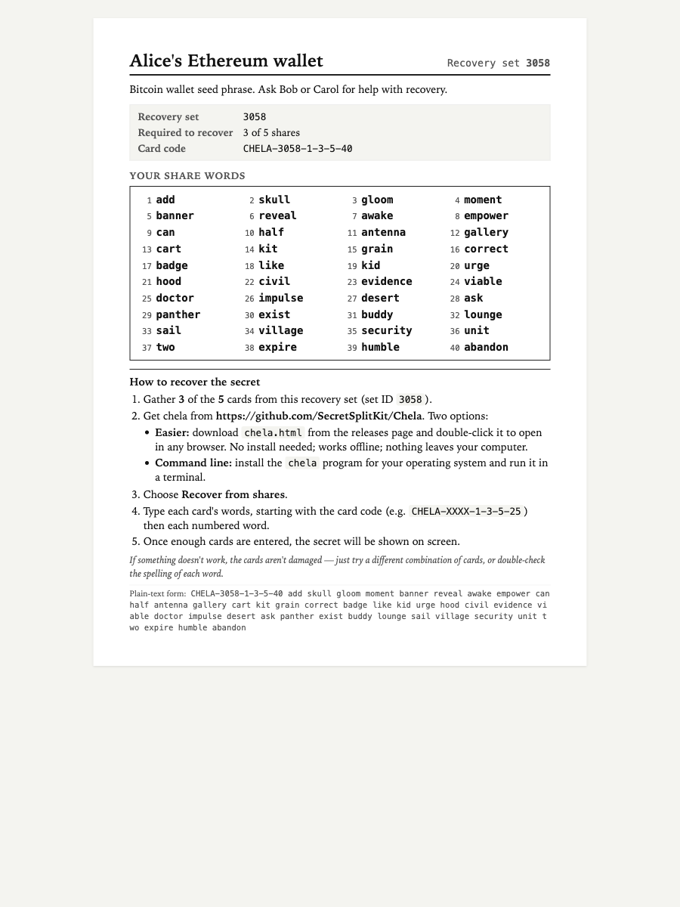
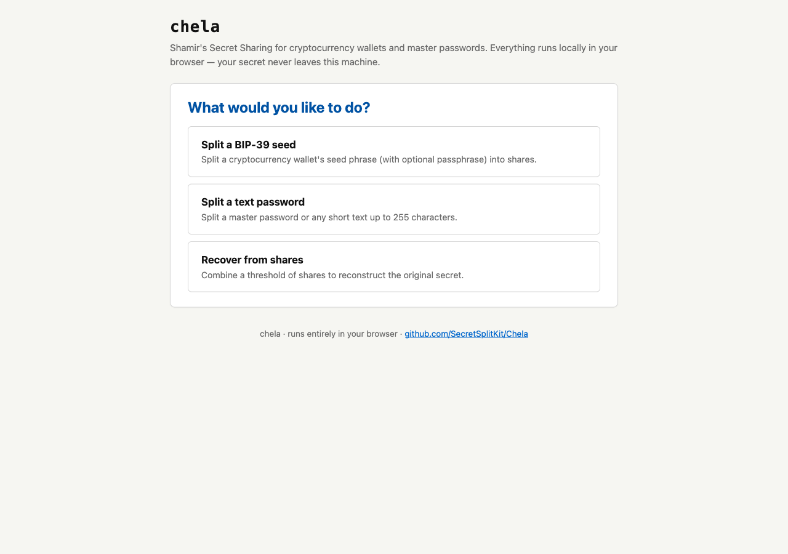
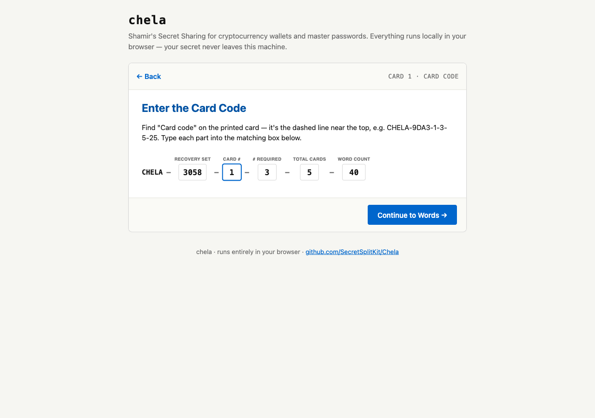
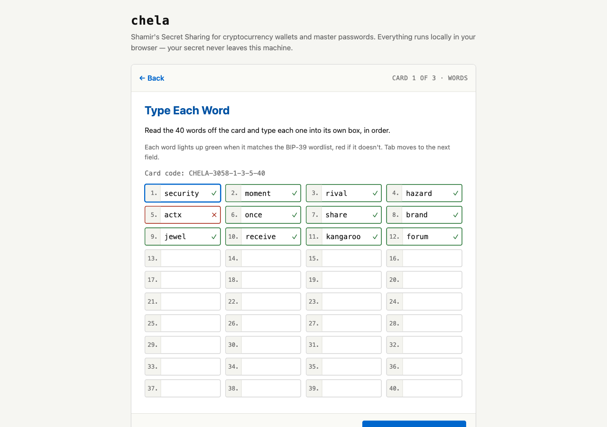
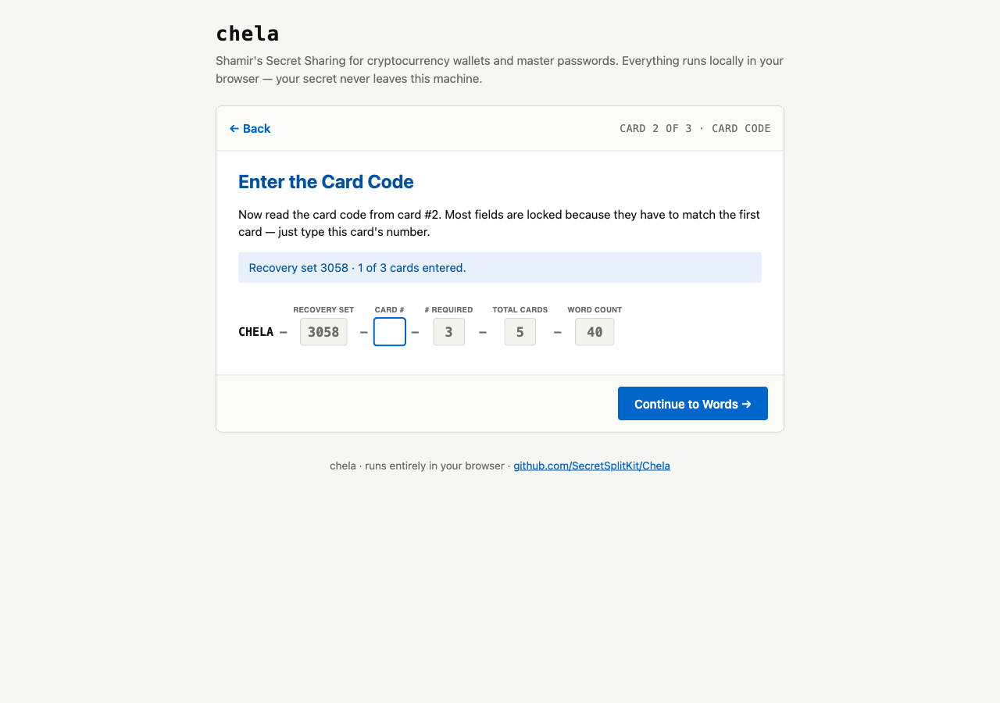
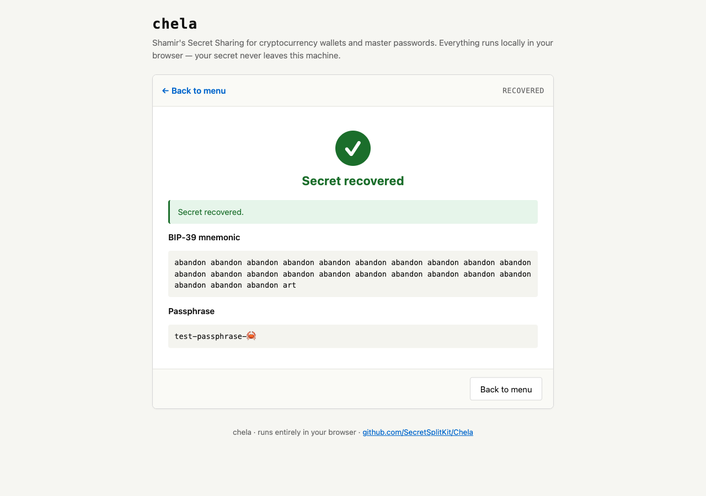

# Recovering a chela backup

This guide is for someone who has been given a chela paper card (or several) and
needs to put them back together to recover a secret — typically a cryptocurrency
wallet seed phrase or a password.

If you arrived here from one of the cards: **take a breath**. Nothing here is urgent.
The cards are the only thing that can recover the secret, and they don't expire.
You can come back to this tomorrow if you need to.

You don't need to install anything. You don't need to know how a computer works
beyond opening a web browser and double-clicking a file. The whole recovery happens
on your own machine, with no internet involved.

## What a chela card looks like

Each printed card has a title at the top, a "Required to recover" line, a
card code like `CHELA-3058-1-3-5-40`, a numbered list of words, and short
recovery instructions printed at the bottom:

(This is a sample — yours will have the real holder's name and the real words on it.)

## Before you start

You'll need:

- **A computer** running Windows, Mac, or Linux, with any modern web browser
  (Chrome, Edge, Firefox, Safari — any will do).
- **The paper cards.** Each card has a *card code* like `CHELA-3058-1-3-5-40` and a
  list of words (12 to 40 of them, depending on what was stored).
- **A minimum number of cards** — look on the front of the card for *"M of N"*. For
  example, **3 of 5** means you need any 3 cards out of the 5 that were made. If you
  only have 2 of the 5, you can't recover yet — you need a third.

You do *not* need an internet connection during the recovery itself (only to
download the recovery program, once).

---

## Step 1 — Download the recovery program

Open your web browser and go to:

**<https://github.com/SecretSplitKit/Chela/releases/latest>**

This page is GitHub. Scroll down to the section called **Assets** — you'll see a
list of files. Find the one whose name ends with **`-web.html`** (for example
`chela-v1.0.0-web.html`). Click that file's name. Your browser will download it.
**It is just a single file.**

Save it somewhere you'll remember:

- **Windows:** the *Downloads* folder is fine; the *Desktop* is even easier to find.
- **Mac:** *Downloads* or *Desktop*.
- **Linux:** wherever you usually save downloads.

---

## Step 2 — Open the file you just downloaded

### Windows

1. Open **File Explorer** and go to the folder where you saved the file (probably
   *Downloads* or *Desktop*).
2. **Double-click `chela-vX.Y.Z-web.html`**.
3. Your default web browser will open with chela's main screen.

If Windows shows a security warning ("Windows protected your PC"), this is normal
for files downloaded from the internet. Click **More info** → **Run anyway**, or
right-click the file → **Properties** → check **Unblock** → **OK**, then
double-click again.

### Mac

1. Open **Finder** and go to the folder where you saved the file (probably
   *Downloads*).
2. **Double-click `chela-vX.Y.Z-web.html`**.
3. Your default web browser will open with chela's main screen.

If macOS shows a warning that the file is from the internet, click **Open** (or, if
you don't see an Open option, **Cancel** then right-click the file → **Open With** →
your browser of choice).

### Linux

1. Open your file manager and go to the folder where you saved the file.
2. **Double-click `chela-vX.Y.Z-web.html`**, or right-click → **Open With** →
   choose your browser.

---

## Step 3 — Click "Recover from shares"

The chela main screen has three large buttons. Click the third one:
**Recover from shares**.

---

## Step 4 — Enter the first card

The wizard will ask for **the card code** first — the dashed line near the top of
your card, like `CHELA-3058-1-3-5-40`. The boxes on screen line up with the dashes:
type each part into its matching box.

Click **Continue to Words**.

Now the wizard asks for each word on the card. Type the word into each box in
order. Each word turns **green with a ✓** when it matches the BIP-39 wordlist, or
**red with an ✗** if it doesn't (which usually means a typo — check the card and
re-type):

When all the words are typed and green, click **Save Share, Next Card**.

---

## Step 5 — Repeat for each remaining card

For every card after the first, the wizard pre-fills most of the card code for you
— you only need to type the **card #** (the second number in the dashed line, e.g.
`2` in `CHELA-3058-2-3-5-40`):

Then type that card's words, click **Save Share, Next Card**, and continue until
you've entered the minimum number ("M of N") that the cards say is required.

---

## Step 6 — Read the recovered secret

After the last required card, click **Recover Secret**. The recovered secret
appears on the next screen:

This is the secret the cards were protecting. Write it down somewhere safe (a piece
of paper kept in a secure location is fine for short-term use). What you do with it
next depends on what it unlocks:

- **A cryptocurrency wallet seed phrase** — type it into the wallet app the original
  owner used (e.g. MetaMask, Ledger Live, Trezor Suite). Look up "import seed phrase
  into [wallet name]".
- **A password** — that's just the password. Use it to log in to the persons computer,
  password manager, or something else that they may have noted.

When you're done, close the browser tab. chela does not store anything on disk.

---

## Troubleshooting

### "I only have some of the cards — can I still recover?"

You need at least **M** cards (the number in "M of N" on the front, e.g. 3 of 5
means any 3 cards). If you have fewer than M, you cannot recover, and chela cannot
help — that's the design of the system. If you can't find the missing cards, the
secret may be permanently lost.

### "A word on my card is smudged and I can't read it"

The BIP-39 wordlist only has 2048 words and each starts with a unique 4-letter
prefix. If you can read even the first 4 letters of a smudged word, look it up on
the [BIP-39 English wordlist](https://github.com/bitcoin/bips/blob/master/bip-0039/english.txt)
and type the full word.

If a whole word is unreadable, you can sometimes still recover by trying the most
likely candidates one at a time — but you may need help from someone technical.

### "The wizard says 'Recovery failed' or 'Bundle corrupt'"

This usually means one of the cards has a typo. Click **← Back** repeatedly to
return to that card's words, look carefully for any mis-typed words (the green ✓
catches single-word typos, but not when you type a *different* valid word by
mistake), correct them, and continue.

### "My browser opened the file as raw code instead of a web page"

Right-click the file → **Open With** → choose your browser explicitly (Chrome,
Firefox, Edge, Safari).

---

## Privacy and safety

- **Nothing is sent over the internet.** chela's recovery program is a single
  self-contained HTML file. Everything happens inside your browser, on your own
  machine.
- **You can disconnect from Wi-Fi before recovering** if you want belt-and-braces
  safety. The recovery works the same way offline.
- **When you close the browser tab, the secret is gone from the computer.** chela
  does not save anything to disk.
- **Don't take screenshots of the recovered-secret screen.** Screenshots end up in
  cloud backups (iCloud, OneDrive, Google Photos) and become a way for the secret
  to leak. Write it down on paper instead.

---

## For the cautious — verify the download

This step is optional. It exists for people who want to confirm that the file they
downloaded is exactly the file that the chela maintainers released, not a tampered
copy. It requires installing a small command-line tool called `minisign`. Most
people skip this and rely on GitHub's HTTPS download being trustworthy.

See the **Verifying a release** section of the [README](./README.md#verifying-a-release)
for the full procedure.
