# Chela: explanation and format specification

This document does two things at once: it **explains** how *Chela* works and why it
is built the way it is, and it **specifies** the share format precisely enough to
write an independent, compatible implementation.

Read it top to bottom: every idea is introduced before it is used. Most steps are
explained three ways:

- **Plain terms** - what it does and why, no math.
- **The math** - the underlying theory (only high-school algebra assumed).
- **In bits & bytes** - how that theory becomes the actual words on a card.

Sections 1–3 build the idea, section 4 defines a share word by word, section 5 is
recovery, and the rest is carriers, conformance, and reference tables.

---

## 1. The problem Chela solves

You have a **secret** worth protecting for the long term - most often a password
or a crypto wallet's recovery phrase (a *BIP-39 seed*, explained in [§ 4, the share layout](#4-a-share-word-by-word)), but it
can be any short piece of text (up to 255 bytes). You want to back it up so
that:

- losing one or two backups does **not** make your secret irrecoverable, and
- finding one backup does **not** hand a thief any information about your secret.

The do-it-yourself version fails badly. Say you tell part of your password to your
mom, email another part to a friend, and stick the last part to your monitor. To
put the secret back together you need every piece *and* the order they go in - lose
one, or forget the order, and it's gone; whoever is reassembling is left trying
orderings one by one. And every piece is part of the secret, so each person holding
one already knows a chunk of it: less of the secret left to guess, a head start if
any piece leaks, and an opening for one holder to cheat the others and recover it
alone. *Chela* solves both problems at once with a technique called
**Shamir's Secret Sharing**.

## 2. The core idea: shares, and the two numbers

**Shamir's Secret Sharing** (SSS) turns your secret into pieces called **shares**. When you create them you
choose two numbers:

- how many shares to make **in total**, and
- how many of them are **needed** to put the secret back together.

The second number is where the magic lives. Suppose you make 5 shares and set
"3 needed." Then:

- **Any** 3 of the 5 rebuild the secret exactly - so two shares can be lost or
  destroyed and you are still fine.
- Hold only 2 (or 1) and you learn **nothing at all**: not a partial secret, not
  a head start for guessing - mathematically nothing.

Two names used throughout this document:

- **M - the threshold:** how many shares are *needed* to recover.
- **N - the total:** how many shares were *made*. Always `M ≤ N`.

So "5 shares, 3 needed" means `N = 5`, `M = 3`, usually written **3-of-5**.

In *Chela*, each share is written as a short **list of ordinary words** - the same
kind of words as a wallet seed phrase.

Four properties follow from the design. Each is stated here and *explained later*,
in the section that introduces the mechanism delivering it:

| Property | Where it's explained |
|---|---|
| One share reveals nothing | [§ 3 (Security)](#3-how-shamirs-secret-sharing-works), [§ 4.4 (The Type of Secret)](#44-the-kind-byte--what-the-secret-is-and-where-it-ends) |
| You only need any `M` shares; the other `N − M` can be lost | [§ 3 (How Shamir's Secret Sharing Works)](#3-how-shamirs-secret-sharing-works) |
| A share recovers from its words alone - no other knowledge is needed | [§ 4 (The Share Layout)](#4-a-share-word-by-word), [§ 5 (Recovery)](#5-recovery-from-words-alone) |
| A mistyped or swapped word is caught, never silently mis-recovered | [§ 4.5 (The Checksum)](#45-the-last-word--the-checksum-crc) |
| The wrong set of shares is caught, never returned as a wrong secret | [§ 5 (Recovery)](#5-recovery-from-words-alone) |

---

## 3. How Shamir's Secret Sharing works

### 3.1 The idea, as a curve

**Plain terms.** Hide the secret - say it is the number **42** - as the height
where a curve crosses the vertical axis: its value at `x = 0`. Each share is a
point on that same curve at some `x ≠ 0`. The curve is rigid: a straight line is
fixed by any two of its points, so two shares are enough to draw the whole line
back and read its height at `x = 0` - the secret (Figure 1).

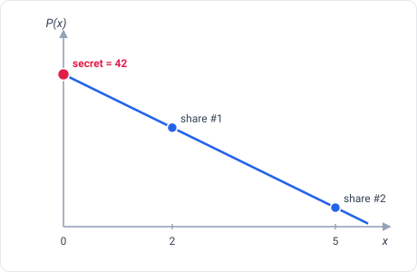

*Figure 1 - Two shares fix the whole line (threshold `M = 2`); extend it back to
`x = 0` and read off the secret.*

The **threshold `M`** is just how many points it takes to pin the curve down:
`M = 2` is a line, `M = 3` a parabola, higher `M` a higher-degree curve (Figure 2).

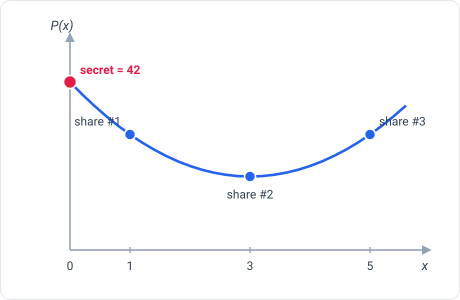

*Figure 2 - A higher threshold means a higher-degree curve: `M = 3` is a parabola,
so it takes three shares to pin down - and `P(0)` is still the secret.*

Below the threshold you learn nothing. With fewer than `M` points the curve is not
pinned down - infinitely many curves of that degree pass through the points you
hold, and they cross `x = 0` at every possible height. So `M − 1` shares leave the
secret exactly as unknown as zero shares would (Figure 3).

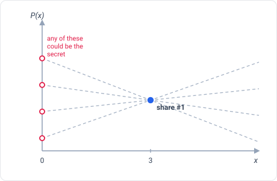

*Figure 3 - One share (here at `x = 3`) lies on infinitely many lines, each hitting
`x = 0` at a different value; every secret stays equally possible.*

**The math.** The "curve" is a polynomial `P(x)` of degree `M − 1`. Its constant
term is the secret: `P(0) = secret`. The other `M − 1` coefficients are chosen at
random. A share is a point `(x, P(x))` for some `x ≠ 0`. A degree-`(M − 1)`
polynomial is uniquely determined by any `M` of its points - that's *Lagrange
interpolation* - so any `M` shares recover `P`, and hence `P(0)`. With only
`M − 1` points, for *every* possible secret there is exactly one degree-`(M − 1)`
polynomial through your points that hits that secret at `x = 0`. All secrets stay
equally possible: that is the (information-theoretic) security guarantee, and it
is why "fewer than `M`" leaks nothing.

This maps back to the two numbers from [§ 2, the core idea](#2-the-core-idea-shares-and-the-two-numbers): `M` is the polynomial's
degree plus one, and a share's `x` is simply *which point on the curve* it holds.

### 3.2 Chela's construction: one polynomial per byte

**Plain terms.** A secret is many **bytes** - each just a number from 0 to 255 - so
*Chela* doesn't use one curve; it uses one curve *per byte* of the secret, all
sharing the same set of `x` points. A share for a given `x` is just *each curve's
value at that `x`* - one output byte per secret byte. We call a share's output bytes
its **Y values**; there are exactly as many as there are secret bytes, and on their
own they look random.

Our running example is the text **"42"**: its body is four bytes - the characters
`0x34` and `0x32`, a one-byte integrity tag, and a one-byte type marker (the *kind
byte*, [§ 4.4, the kind byte](#44-the-kind-byte--what-the-secret-is-and-where-it-ends)) - so
it rides on four curves, and a share is the column of their values at one `x`
(Figure 4).

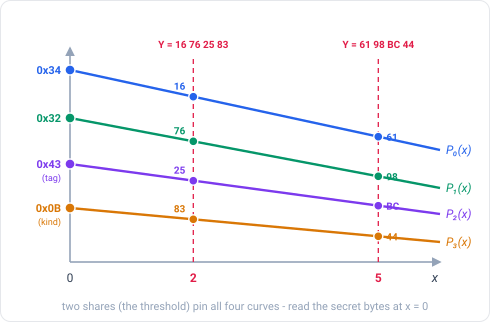

*Figure 4 - Each body byte is the constant term of its own curve. Any two shares
(here `x = 2` and `x = 5`) pin all four curves; one share alone reveals nothing
about the byte values at `x = 0`.*

**The math.** Let the bytes being split be `body[0], body[1], …` (the **body** is
defined in [§ 4.3, the body](#43-words-2--w2--this-shares-piece-of-the-secret-the-body) - for now it's "the secret bytes"). For each byte `i`, build a
polynomial whose constant term is that byte and whose higher coefficients are
fresh random bytes:

```text
P_i(x) = body[i] ⊕ r_{i,1}·x ⊕ r_{i,2}·x² ⊕ … ⊕ r_{i,M-1}·x^{M-1}    (all in GF(2⁸))
```

The share at coordinate `x` is the byte vector `Y = [P_0(x), P_1(x), …]`. Here `⊕`
and `·` are byte arithmetic in **GF(2⁸)** - a way to add and multiply bytes that
always lands back on a byte - defined in
[§ 3.4, the byte arithmetic](#34-the-byte-arithmetic-gf2).

**In bits & bytes.** The random coefficients come from the operating system's
**CSPRNG** (Cryptographically Secure Pseudo-Random Number Generator) - fresh bytes
per split. Their randomness is the entire security of the scheme: predict them and
you break it. (The coordinate `x`, by contrast, is *public* - it ends up printed
in the words - so it does not need to be secret, only well-formed; see
[§ 3.3, choosing x and M](#33-choosing-the-coordinates-x-and-the-threshold-m).)

### 3.3 Choosing the coordinates `x` and the threshold `M`

**Plain terms.** Every share gets its own number, `x`. *Chela* picks each `x` *at
random* from 1 to 32 (not 1, 2, 3, …). Random numbering means a stray card gives
away neither how many cards exist nor where it sits in the set.

**The math.** `x = 0` is reserved - that's the secret itself - so share
coordinates live in `1..=32`. A split draws `N` **distinct** coordinates;
duplicates or `x = 0` are rejected, because Lagrange interpolation ([§ 3.1, the curve](#31-the-idea-as-a-curve)) needs
distinct points and `x = 0` would hand out the secret directly. The threshold has
a floor of `M = 2`: a "1-of-N" split is just plain copies and provides no
secret-sharing security, so it is rejected. Both `M` and `N` cap at **32**.

**In bits & bytes.** Each `x` is `(rng_byte & 0x1F) + 1`: the low 5 bits of a fresh
CSPRNG byte give a uniform value `0..31` (a power-of-two range, so no modulo bias),
mapped to `1..=32`. Draw without replacement (re-draw on a collision).

### 3.4 The byte arithmetic: GF(2⁸)

The curves in [§ 3.1, the curve](#31-the-idea-as-a-curve) and
[§ 3.2, one polynomial per byte](#32-chelas-construction-one-polynomial-per-byte) add
and multiply **bytes**, and the answer always has to be another byte (0–255).
Ordinary arithmetic won't do: `200 + 100` is `300`, which a byte can't hold (it only
goes up to 255), and dividing makes fractions, which a byte can't hold either.
*Chela* needs a self-contained number system whose only values are the 256 bytes and
in which `+`, `−`, `×`, and `÷` (by anything but zero) always land back on a byte. A
number system with all four operations is called a **field**, and the one with
exactly 256 elements is **GF(2⁸)** - the same field AES (the Advanced Encryption
Standard) uses. It is built in five steps, each standing on the one before.

**1 - Clock arithmetic, `GF(p)`.** The simplest fields are clock faces. Work modulo a
prime `p`: count `0, 1, …, p−1`, and whenever you pass `p`, wrap back to `0`. On a
7-hour clock `5 + 4 = 2` (Figure 5). The property that makes this a *field* is division: every
non-zero value needs a **multiplicative inverse**, a partner that multiplies with it
to give `1` (so "÷" is defined as "× the inverse"). Modulo 7, `3 × 5 = 15 = 1`, so
"÷3" is "×5". This works only when `p` is **prime** - on a 6-hour clock `2 × 3 = 0`,
and `2` has no inverse, so it is not a field. Call this base field `GF(p)`.

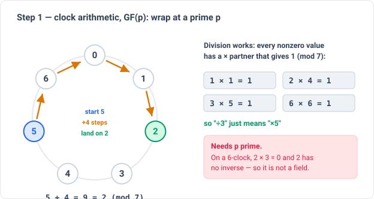

*Figure 5 - Clock arithmetic modulo a prime: `5 + 4` wraps to `2` (mod 7), and
every non-zero value has a multiplication partner that gives `1`, so division is
defined. It fails when the modulus is not prime - on a 6-clock, `2 × 3 = 0` and `2`
has no inverse.*

**2 - Polynomials over `GF(p)`.** A byte has 256 values, but `256 = 2⁸` is not prime,
so no clock of 256 hours is a field. The way up is to stop using plain numbers and
use **polynomials** - `… + b·x + c` - whose coefficients are drawn from a base field
`GF(p)`. Add, subtract, multiply, and long-divide them as in school algebra, except
the coefficients themselves wrap modulo `p` (Figure 6).

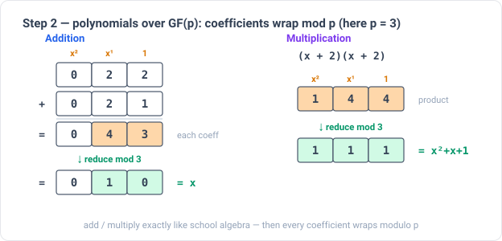

*Figure 6 - Polynomials over `GF(3)`: add and multiply exactly as in school
algebra, then reduce every coefficient modulo `p`. Here `(2x+2) + (2x+1) = 4x+3 → x`
and `(x+2)(x+2) = x²+4x+4 → x²+x+1`.*

**3 - Irreducible polynomials are the "primes."** Step 1 needed `p` prime so the
clock had no zero-divisors. Polynomials need the same guard: a modulus that cannot be
factored into lower-degree polynomials, called an **irreducible** polynomial (Figure 7). It is
the prime of the polynomial world. Reduce by a *reducible* one and you get
zero-divisors and missing inverses - not a field.

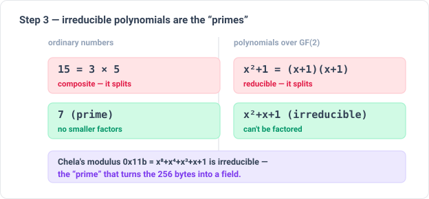

*Figure 7 - An irreducible polynomial is the "prime" of the polynomial world: just
as `7` has no smaller factors, `x²+x+1` cannot be factored over `GF(2)`. Chela's
`0x11b` is the degree-8 irreducible that makes the byte field.*

**4 - Extension fields `GF(pⁿ)`.** Fix a degree-`n` irreducible. The field is every
polynomial of degree below `n`; there are exactly `pⁿ` of them. **Add** by adding
coefficients modulo `p`. **Multiply** by multiplying the polynomials and then taking
the remainder modulo the chosen irreducible - that remainder step is what pulls an
over-degree product back in range, the polynomial version of "wrap at `p`." Every
non-zero element has an inverse, so division works (Figure 8).

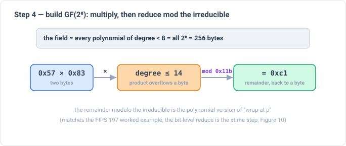

*Figure 8 - The field is every polynomial of degree below 8 - all 256 bytes.
Multiplication multiplies the two, which can overflow a byte, then reduces modulo
the irreducible `0x11b` back to a byte (`0x57 × 0x83 = 0xc1`).*

**5 - The binary case, `GF(2⁸)`.** Set `p = 2` and `n = 8`. Coefficients now live in
`GF(2)`, so each is a single **bit**, and a polynomial of degree below 8 is exactly
**8 bits - one byte** (write `0x2A` as `x⁵ + x³ + x`; its bits are the coefficients).
The 256 bytes *are* the field, and the abstract operations collapse into things a CPU
does directly.

**Addition** adds coefficients modulo 2 - which is **XOR**, bit by bit with no
carries (Figure 9). XOR is its own inverse, so subtraction *is* addition:
`a ⊕ b ⊕ b = a`.

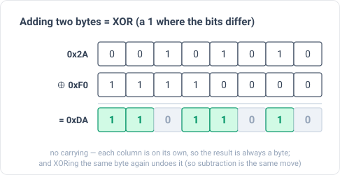

*Figure 9 - Addition is XOR: a `1` in each column where the two bits differ. No
carries, so the result is always a byte - and XORing the same byte twice cancels.*

**Multiplication** multiplies the two polynomials - which can push powers above `x⁷`,
past a byte - then reduces modulo a degree-8 irreducible. In practice it is built
from **`xtime`** (multiply by `x`): shift the byte left one bit, and if a bit spilled
past bit 7, XOR the low byte of the reduction polynomial (Figure 10). A full `a × b`
XORs together one `xtime`-d copy of `a` for each 1-bit of `b`. That asymmetry - add is
XOR, multiply is "polynomial-multiply, then reduce" - is the whole of the field.

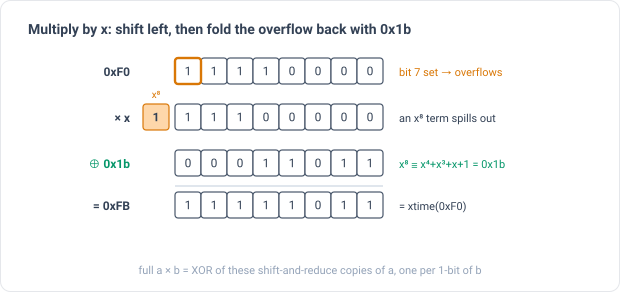

*Figure 10 - Multiplication is built from "multiply by `x`" (`xtime`): shift left,
and whenever a bit spills past bit 7, fold it back with `0x1b`. A full `a × b` XORs
one shifted-and-reduced copy of `a` per 1-bit of `b`.*

**Which GF(2⁸)?** Step 4 said "a degree-8 irreducible," not *which* one - and the
choice changes the multiplication table. AES, Reed–Solomon, and QR codes each pick a
different one, so "GF(2⁸)" by itself is ambiguous. *Chela* pins the **AES / Rijndael**
polynomial `x⁸ + x⁴ + x³ + x + 1` - the 9-bit constant `0x11b`, whose low byte `0x1b`
is the value folded in by `xtime` (because modulo `0x11b`, `x⁸ ≡ x⁴ + x³ + x + 1 =
0x1b`). A reimplementation that picks any other irreducible computes a *different*
arithmetic and will not interoperate.

**In bits & bytes.**

```text
add(a, b) = a XOR b
mul(a, b) = XOR over i=0..7 of:  ((b >> i) & 1) ? xtime_i(a) : 0
            xtime_0(a) = a
            xtime_i(a) = let v = xtime_{i-1}(a); (v << 1) XOR (v & 0x80 ? 0x1b : 0)
inv(0)    = 0       (by convention; recovery never inverts 0)
inv(x)    = x^254   for x ≠ 0    (Fermat's little theorem in GF(2⁸))
```

Sanity check (FIPS 197 § 4.2): `mul(0x57, 0x83) = 0xc1`.

**Implementer's trap - `0x11b` is not primitive.** A table-based implementation
(a 256-entry log / antilog pair) is faster and gives bit-identical results - but only
if it is built around a true **generator** of the 255-element multiplicative group.
The AES polynomial is irreducible but *not primitive*, so `x` (the byte `0x02`) does
**not** generate the group - its multiplicative order is only 51. A log table based
on `0x02` is simply wrong. Use a primitive element such as **`0x03`** (`x + 1`),
whose order is the full 255, as the table's base.

---

## 4. A share, word by word

A share is rendered as a list of **BIP-39 words**. *BIP-39* (Bitcoin Improvement
Proposal 39) defines a fixed list of 2048 English words; the only thing *Chela* uses
from it is that list. Each word stands for an **11-bit number**, 0–2047 - its
position in the list (verify the list against the SHA-256 in [§ 8.1, the constants table](#81-constants)). So a share is
really a list of 11-bit numbers, written as words for humans to transcribe.

*Chela* packs values into those 11-bit words **MSB-first** ("Most Significant Bit
first" - the highest-value bit leads, the way we write ordinary numbers
left-to-right). A share is `W` words (`W ≥ 4`) in four sections; **no byte ever
straddles a section boundary**, which keeps the layout auditable by hand:

```text
word 0          : [ X:5 | M:5 | reserved:1 ]   which share this is, and how many are needed
word 1          : [ nonce:11 ]                  the batch id (same on every card of one split)
words 2 .. W-2  : [ Y values ]                  this share's piece of the secret
word W-1        : [ CRC-11 ]                     a checksum that catches transcription errors

W = 2 + ceil(body_len · 8 / 11) + 1            (minimum 4; body_len defined in § 4.3)
```

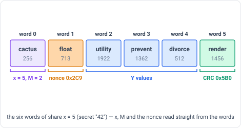

*Figure 11 - A real share (`x = 5`) of the "42" example. The words alone carry `x`,
`M` and the nonce; any carrier metadata ([§ 6, carriers](#6-carriers-text-json-html))
only echoes them.*

The sections below take them in order.

### 4.1 Word 0 — which share, and how many are needed (`x`, `M`)

**Plain terms.** The first word carries the two numbers recovery can't run without:
this share's own number (`x`, from [§ 3.3, choosing x and M](#33-choosing-the-coordinates-x-and-the-threshold-m)) and how many shares are needed (`M`,
the threshold).

**The math.** `x` says which point on the curves ([§ 3.1, the curve](#31-the-idea-as-a-curve)) this card holds; `M` says
how many cards must be combined. Both are stored as small **offsets** so the
illegal values literally cannot be written down: `x − 1` (since `x = 0` is
reserved) and `M − 2` (since `M < 2` is forbidden).

**In bits & bytes.** 11 bits, MSB-first - bits 10..6 are the `x` field, bits 5..1
the `M` field, bit 0 is reserved (and must be 0):

```text
x_field = x − 1                 # x in 1..32  → field 0..31   (x = 0 cannot be encoded)
m_field = M − 2                 # M in 2..32  → field 0..30   (M < 2 cannot be encoded)
word0   = (x_field << 6) | (m_field << 1)        # bit 0 (reserved) = 0

decode: x = ((word0 >> 6) & 0x1F) + 1
        M = ((word0 >> 1) & 0x1F) + 2
```

For our "42" example's `x = 5`, `M = 2` share that is `x_field = 4`, `m_field = 0`,
so `word0 = (4 << 6) = 0x100` - the word *cactus*.

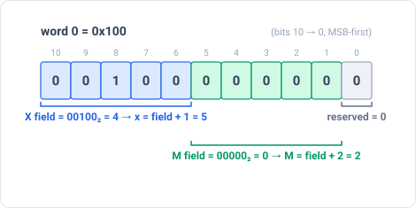

*Figure 12 - Word 0 of the `x = 5`, `M = 2` share. X and M are stored as offsets
(`x − 1`, `M − 2`), so the illegal values can't be written; the reserved bit is 0.*

Reject the share if the reserved bit ≠ 0, or if the `M` field is 31 (that would
decode to `M = 33`, above the cap). `M ≤ N` is not stored - it is enforced when
splitting, and is automatic at recovery (you can't combine more cards than you
hold).

### 4.2 Word 1 — the batch id (nonce)

**Plain terms.** Suppose you back up the *same* secret twice, on two separate
occasions. Each backup is its own batch of cards, and the two batches are **not
interchangeable** - mixing a card from batch A with cards from batch B produces
garbage. Word 1 is a random **batch stamp**, identical on every card of one
split, so the tool can tell which cards belong together and refuse a mix. (The
common name for such a one-shot random tag is a **nonce**.)

**The math.** Each split (re)draws its random polynomials ([§ 3.2, one polynomial per byte](#32-chelas-construction-one-polynomial-per-byte)), so two splits
of the same secret sit on *different* curves; their points can't be combined. The
nonce is a fresh random tag per split, so the two batches carry different stamps
and the mismatch is caught immediately. Note it is **not** derived from the secret
- deriving it from the secret would (a) wrongly mark the two batches as
combinable, and (b) leak a fingerprint of the secret. Two *unrelated* splits land
on the same 11-bit stamp only by 1-in-2048 chance; even then nothing breaks ([§ 5, recovery](#5-recovery-from-words-alone)).

**In bits & bytes.** 11 random bits from the CSPRNG, drawn once per split and
written verbatim into word 1 of every share in that split. In the "42" example the
draw was `0x2C9` - the word *float* - the same word 1 on all three shares.

### 4.3 Words 2 … W−2 — this share's piece of the secret (the body)

**Plain terms.** These words carry this card's **Y values** ([§ 3.2, one polynomial per byte](#32-chelas-construction-one-polynomial-per-byte)) - the secret,
in split form, plus a one-byte integrity check (the **tag**) and one byte ([§ 4.4, the kind byte](#44-the-kind-byte--what-the-secret-is-and-where-it-ends)) that records what type of secret it is.

**The math.** What actually gets split is the **body**:

```text
body = payload ‖ tag ‖ kind_byte
```

The **payload** is the raw secret bytes. The **tag** is a one-byte integrity check,
`SHA-256(payload ‖ kind_byte)[0]`, that binds the whole secret: combine the wrong
shares and the recovered tag won't match, so recovery fails ([§ 5, recovery](#5-recovery-from-words-alone)) instead of
handing back a plausible wrong secret. The **kind byte** ([§ 4.4, the kind byte](#44-the-kind-byte--what-the-secret-is-and-where-it-ends)) is the
body's last byte. (The symbol `‖` means **concatenation**: the bytes on either side joined
end to end, nothing in between.) SSS ([§ 3.2, one polynomial per byte](#32-chelas-construction-one-polynomial-per-byte)) turns the body into this share's `Y`
values - one output byte per body byte - so the `Y` vector is exactly `body_len` bytes long
(`body_len = payload length + 2`). The payload depends on the kind:

| Kind | Payload bytes |
|---|---|
| BIP-39 seed, no passphrase | the seed's `entropy` (16/20/24/28/32 bytes) |
| BIP-39 seed, with passphrase | `entropy ‖ passphrase_utf8` (passphrase 1–255 bytes) |
| Text | the `text` as UTF-8 (1–255 bytes) |

(A BIP-39 mnemonic is interchangeable with its underlying `entropy` - 12/15/18/
21/24 words ↔ 16/20/24/28/32 bytes - so *Chela* splits the compact entropy and
re-derives the words on recovery. *UTF-8* is the standard text-to-bytes encoding.)

**In bits & bytes.** Pack the `Y` bytes MSB-first, 11 bits at a time, into words.
Byte boundaries (8 bits) and word boundaries (11 bits) don't line up, so the last
word is zero-padded on the right to fill its 11 bits. With `len = body_len` there
are `ceil(len · 8 / 11)` body words. The "42" example has body `34 32 43 0B` (4 bytes:
payload `34 32`, tag `43`, kind `0B`), so each share carries four `Y` bytes packed into
three body words (Figure 13).

```text
bit b of the Y byte-stream  →  word (b / 11), bit position (10 − b mod 11)   # MSB-first
any leftover bits of the last word are 0
```

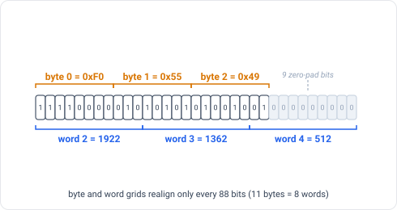

*Figure 13 - The `x = 5` share's `Y = 61 98 BC 44` packed MSB-first: four bytes fill
two whole words plus ten bits of a third, and the last bit is zero padding - the
misalignment that [§ 4.6, word-count ambiguity](#46-why-the-word-count-is-slightly-ambiguous) has to resolve.*

### 4.4 The kind byte — *what* the secret is, and *where it ends*

**Plain terms.** The body's final byte names the secret's type - which size of
seed, with or without a passphrase, or plain text. Because it is split *inside*
the body, a single share never reveals the type. It also does double duty as an
**end-marker** for the data (see "the math").

**The math.** The byte is a small **non-zero** value, `0x01`–`0x0B`. The packing in
[§ 4.3, the body](#43-words-2--w2--this-shares-piece-of-the-secret-the-body) pads with **zero** bits, so a padding byte read back is always `0x00`.
Therefore, once the body is reconstructed, *the last non-zero byte is the kind
byte, and it marks the true end of the data*. This is what lets recovery pin down
the exact length despite the 8-vs-11-bit misalignment ([§ 4.6, word-count ambiguity](#46-why-the-word-count-is-slightly-ambiguous), [§ 5, recovery](#5-recovery-from-words-alone)).

**In bits & bytes.** One byte, the body's last byte - after the payload and the
integrity tag; recovery reads it from `body[len − 1]` (in the "42" example,
`0x0B` = Text). Any value outside the table is rejected (`BundleCorrupt`).

| `kind_byte` | Meaning |
|---|---|
| `0x01`–`0x05` | BIP-39 12 / 15 / 18 / 21 / 24 words (16/20/24/28/32 B entropy), no passphrase |
| `0x06`–`0x0A` | BIP-39 12 / 15 / 18 / 21 / 24 words, with passphrase |
| `0x0B` | Text |

### 4.5 The last word — the checksum (CRC)

**Plain terms.** The final word is a check value - like the check digit on a
credit-card number - so a mistyped or swapped word is caught instead of silently
producing the wrong secret.

**The math.** It is a **CRC** (Cyclic Redundancy Check): treat the share's bytes
as one long binary number (a polynomial over GF(2) - bit-wide arithmetic where add
is XOR, the same rule as GF(2⁸) in [§ 3.4, the byte arithmetic](#34-the-byte-arithmetic-gf2)) and take the remainder after dividing by
a fixed 11-bit generator polynomial, `0x307`. *Chela* uses the
catalogued variant **CRC-11/UMTS**. An 11-bit CRC is *guaranteed* to detect any
error confined to a single word: one wrong word changes at most 11 adjacent bits
(a "burst" of length ≤ 11), and an 11-bit CRC catches every burst of length ≤ 11.

**In bits & bytes.** The CRC is computed over the share's *meaning* - `x`, `M`,
the nonce, and the `Y` bytes - so a mistyped word 0 or word 1 is caught too. The
parameters (`init 0`, no input/output bit-reflection, no final XOR) make it plain
GF(2) long division - checkable by hand and against any standard CRC tool;
catalogue check value `0x061` over the ASCII string `"123456789"`.

```text
crc_input = [x, M] ‖ nonce_be ‖ Y_bytes    # x and M one byte each; nonce_be = word 1 as two big-endian bytes
word_last = CRC-11/UMTS(crc_input)          # the 11-bit remainder fills the last word

crc = 0x000
for each input byte:
    crc ^= byte << 3                 # align the byte's top bit with bit 10 of the 11-bit register
    repeat 8 times:
        top = crc & 0x400
        crc = (crc << 1) & 0x7FF
        if top: crc ^= 0x307
```

For the "42" example's `x = 5` share, `crc_input = 05 02 02 C9 61 98 BC 44` gives CRC
`0x6EC` - the word *talk*, the sixth and last word of the share.

### 4.6 Why the word count is slightly ambiguous

**Plain terms.** Because 8 (bits per byte) and 11 (bits per word) don't divide
evenly, two body lengths that differ by one byte can pack into the *same* number
of words. So the word count alone doesn't reveal the exact byte length - but the
kind-byte terminator ([§ 4.4, the kind byte](#44-the-kind-byte--what-the-secret-is-and-where-it-ends)) does, at recovery ([§ 5, recovery](#5-recovery-from-words-alone)).

**The math.** The byte grid and the word grid only realign every
`lcm(8, 11) = 88` bits (= 11 bytes = 8 words). For a given count `k` of body words,
the body length is therefore one of at most two consecutive values:

```text
k = W − 3                                  (number of body words)
max_bytes = (k · 11) / 8                    (integer division)
min_bytes = ceil(((k − 1) · 11 + 1) / 8)
```

**In bits & bytes.** A *single* share, checked on its own (no set to combine
with), can't know which of the two lengths is real, so it is only *validated*, not
length-pinned: unpack at each candidate length and accept the first whose
`CRC-11/UMTS([x, M] ‖ nonce_be ‖ body)` matches the stored CRC; none →
`ShareCorrupt`. The *authoritative* length is decided across the whole set at
recovery ([§ 5, recovery](#5-recovery-from-words-alone)), using the terminator.

---

## 5. Recovery (from words alone)

**Plain terms.** Gather any `M` cards, transcribe their words, and the tool redraws
the curves and reads the secret off at `x = 0`. Nothing but the words is needed -
no label, no file.

**The math.** Each body byte is rebuilt by Lagrange interpolation at `x = 0`:

```text
L_i(0) = product over j ≠ i of  ( x_j / (x_i ⊕ x_j) )      (GF(2⁸); ⊕ is also subtraction)
body[i] = XOR over the chosen shares of  ( L_i(0) · share_{x_i}[i] )
```

**In bits & bytes.** A decoder MUST accept a bare list of BIP-39 words. The
algorithm:

1. **Per share** - read `W` words (`W ≥ 4`); reject any value ≥ 2048. Word 0 →
   `x`, `M` (reject if the reserved bit ≠ 0 or the `M` field is 31). Word 1 →
   nonce. Word `W−1` → the stored CRC. Words `2..W−2` are the packed `Y` bytes.
2. **Agree** - all shares MUST share the same nonce, the same `M`, and the same
   body-word count `k`, else `MismatchedShares`. Require at least `M` shares with
   **distinct** `x` (fewer → `InsufficientShares`; a duplicate or `x = 0` → reject).
3. **Reconstruct at the longer length** - unpack every share's `Y` to `max_bytes`
   ([§ 4.6, word-count ambiguity](#46-why-the-word-count-is-slightly-ambiguous)) and Lagrange-interpolate at `x = 0` → a candidate `body` of `max_bytes`.
4. **Find the true length (the terminator)** - the kind byte is never `0x00` and
   any over-read byte is zero padding, so: if `max_bytes > min_bytes` and
   `body[max_bytes − 1] == 0x00`, the true length is `min_bytes` (drop that padding
   byte); otherwise it is `max_bytes`. This resolves [§ 4.6, word-count ambiguity](#46-why-the-word-count-is-slightly-ambiguous) deterministically for
   the whole set - no per-share guessing.
5. **Verify each share** - recompute `CRC-11/UMTS([x, M] ‖ nonce_be ‖ Y[..len])`
   for every share and compare to its stored CRC; a mismatch (a mistyped word) →
   `ShareCorrupt`.
6. **Interpret** - kind = `body[len − 1]`, tag = `body[len − 2]`, payload =
   `body[..len − 2]`. Reject (`BundleCorrupt`) unless the kind ([§ 4.4, the kind byte](#44-the-kind-byte--what-the-secret-is-and-where-it-ends)) is
   known, the payload length fits it (no-pass BIP-39 = exactly `entropy_bytes`;
   with-pass = `entropy_bytes + 1 .. entropy_bytes + 255`; text = `1..=255`), and the
   tag equals `SHA-256(payload ‖ kind_byte)[0]` (compared in constant time). The tag
   is what makes a wrong share subset fail here instead of decoding into a different,
   valid-looking secret.

The nonce ([§ 4.2, the nonce](#42-word-1--the-batch-id-nonce)) keeps two different splits from being mixed. In the ≈ 1/2048
case where two *unrelated* splits collide on the same nonce with a matching `M` and
length, the interpolated body is garbage and is rejected at step 6: its kind byte and
its integrity tag almost never both check out (the tag alone fails a wrong body with
probability ≈ 255/256). So recovery **never silently returns a wrong secret**; the
worst case is a clear error.

---

## 6. Carriers (text, JSON, HTML)

The words are authoritative. The carriers below merely transport them with some
human-friendly metadata; an importer derives `x`, `M`, and the nonce from the
words and cross-checks any carrier metadata against them.

### 6.1 Text

```text
CHELA-<NONCE>-<x>-<M>-<N>-<W>      (line 1: the card label)
word1 word2 word3 … wordW           (line 2; blank line between multiple shares)
```

`<NONCE>` is the 4-hex-digit nonce (high bit always 0; parsed case-insensitively);
`<x>` is decimal 1–32; `<M>`/`<N>` are threshold/total; `<W>` is the word count.
The label is **advisory** - the words already carry `x`, `M`, and the nonce; the
label only adds `N`, which recovery never needs. A parser that sees a label MUST
cross-check `<NONCE>`/`<x>`/`<M>` against the words and reject a disagreement
(`HeaderWordsMismatch`); `<N>` may be `?` when the total is unknown.

### 6.2 JSON

A single share:

```json
{
  "type": "chela.share",
  "card_code": "CHELA-02C9-5-2-3-6",
  "set_id": "02C9",
  "card_number": 5,
  "threshold": 2,
  "total": 3,
  "word_count": 6,
  "scheme": "bip39-wordlist",
  "payload_kind": "text",
  "words": ["cactus", "float", "half", "embark", "scale", "volcano"],
  "backup_name": "Alice's note",
  "description": "Optional free-form note.",
  "shareholder_names": ["Alice", "Bob", "Carol"]
}
```

Required: `type`, `card_code`, `set_id`, `card_number`, `threshold`, `word_count`,
`scheme`, `words`; `words.length` MUST equal `word_count`. `set_id` is the 4-hex
nonce; `card_number`/`threshold` (= `x`/`M`) are advisory and cross-checked against
the words. `total` appears only when `N` is known; `payload_kind`
(`"bip39"`/`"text"`) only when the kind is known (omitted for a words-only share).
The `words` array is authoritative. Optional presentation fields: `backup_name`,
`description`, `shareholder_names`.

A bundle of shares:

```json
{ "type": "chela.shares", "shares": [ { /* one share object */ }, … ] }
```

### 6.3 HTML embedding

```html
<script type="application/json" class="chela-share">
{ /* one share JSON object */ }
</script>
```

One block per `<article>`; tools extract via `querySelectorAll('script.chela-share')`.
The encoder MUST escape `<` → `&lt;` inside JSON strings.

---

## 7. Conformance

A conformant implementation MUST:

1. Recover a share from its BIP-39 words alone - no label, no JSON.
2. Read `x`/`M`/nonce from the words and, if a label/JSON is present, cross-check
   its `x`/`M`/nonce and reject a disagreement (`HeaderWordsMismatch`).
3. Reject a share whose reserved bit is set, whose `M` field is 31, or whose CRC
   matches for no candidate length (`ShareCorrupt`).
4. Reject a set whose shares disagree on nonce, threshold, or body length
   (`MismatchedShares`).
5. Reject fewer than `M` shares (`InsufficientShares`) and duplicate or zero `x`.
6. Reject a recovered body whose trailing kind byte is unknown, whose payload length
   doesn't fit the kind, or whose integrity tag `SHA-256(payload ‖ kind_byte)[0]` does
   not match the byte before the kind (`BundleCorrupt`).
7. Treat `chela.share` as a hard schema gate; reject any other `type`.

A conformant implementation MAY: accept extra unknown JSON fields; use constant-
time or table-based GF(2⁸) multiplication (the wire format is identical).

---

## 8. Reference

### 8.1 Constants

| Constant | Value |
|---|---|
| GF(2⁸) reduction polynomial | `0x11b` (x⁸ + x⁴ + x³ + x + 1, the AES/Rijndael polynomial) |
| Threshold `M` range | 2 – 32 |
| Total `N` / coordinate `x` range | 1 – 32 (`x = 0` reserved for the secret) |
| Generation nonce | 11-bit random, one per split, in word 1 |
| Per-share checksum | CRC-11/UMTS, polynomial `0x307`, in the last word |
| `x` field encoding | 5-bit field `0..31`, stored as `x − 1` |
| `M` field encoding | 5-bit field `0..30`, stored as `M − 2` |
| Per-secret integrity tag | 1 byte, `SHA-256(payload ‖ kind_byte)[0]`, before the kind byte |
| Max body length | 289 bytes (32 entropy + 255 passphrase + 1 tag + 1 kind byte) |
| BIP-39 wordlist | English, 2048 entries, 11 bits per word |
| BIP-39 wordlist SHA-256 | `2f5eed53a4727b4bf8880d8f3f199efc90e58503646d9ff8eff3a2ed3b24dbda` |
| JSON `type` | `chela.share` (single), `chela.shares` (bundle) |

### 8.2 Acronyms & symbols

| Acronym | Meaning |
|---|---|
| `‖` | concatenation - bytes joined end to end ([§ 4.3, the body](#43-words-2--w2--this-shares-piece-of-the-secret-the-body)) |
| SSS | Shamir's Secret Sharing ([§ 2–3](#2-the-core-idea-shares-and-the-two-numbers)) |
| GF(2⁸) | Galois Field of 256 elements - byte arithmetic ([§ 3.4](#34-the-byte-arithmetic-gf2)) |
| AES | Advanced Encryption Standard - source of the GF(2⁸) polynomial |
| CRC | Cyclic Redundancy Check - an error-detecting checksum ([§ 4.5, the CRC](#45-the-last-word--the-checksum-crc)) |
| CRC-11/UMTS | the specific 11-bit CRC *Chela* uses (catalogued under the UMTS standard) |
| BIP-39 | Bitcoin Improvement Proposal 39 - the 2048-word mnemonic list ([§ 4, the share layout](#4-a-share-word-by-word)) |
| CSPRNG | Cryptographically Secure Pseudo-Random Number Generator |
| MSB / LSB | Most / Least Significant Bit; "MSB-first" = highest-value bit first |
| XOR | bitwise exclusive-OR (`^`) |
| UTF-8 | the standard 8-bit Unicode text encoding |
| FIPS | (US) Federal Information Processing Standards |

### 8.3 Test vectors

**GF(2⁸):**

```text
mul(0x57, 0x83) = 0xc1                    (FIPS 197 § 4.2)
inv(0x53)       = 0xca                     (AES S-box, pre-affine)
mul(x, inv(x))  = 0x01   for every x in 1..=255
```

**CRC-11/UMTS** - any tool set to `width 11, poly 0x307, init 0x000, refin false,
refout false, xorout 0x000` reproduces these:

```text
crc11_umts("123456789") = 0x061           (reveng catalogue check value)
crc11_umts("")          = 0x000           (the init value)
```

**A full share, end to end.** Running example: the text `"42"`. Payload `34 32`,
tag `0x43` (= `SHA-256(34 32 0B)[0]`), kind `0x0B` (Text), so body `34 32 43 0B`
(4 bytes). Split 2-of-3 with nonce `0x2C9`; the generator drew coordinates
`x = 5, 2, 7`. Take the share at `x = 5`, whose SSS output is `Y = 61 98 BC 44`:

```text
x_field = 4, m_field = 0
word 0 = (4 << 6) | (0 << 1)             = 0x100 = 256
word 1 = nonce                            = 0x2C9 = 713

Y bits (MSB-first) : 0110 0001  1001 1000  1011 1100  0100 0100   (61 98 BC 44, 32 bits)
word 2             : 01100001100               = 0x30C = 780
word 3             : 11000101111               = 0x62F = 1583
word 4             : 00010001000               = 0x088 = 136   (last bit is 0 padding)

crc_input          = [x, M] ‖ nonce_be ‖ Y    = 05 02 02 C9 61 98 BC 44
word 5 = CRC       = 0x6EC = 1772

words (W = 6)      : 256 713 780 1583 136 1772
                   : cactus float ghost shine baby talk

the other two shares : x = 2  amount float biology raise general diet
                       x = 7  copy float duck traffic reason icon
```

Recover from any two - say `x = 5` and `x = 2`. The `k = 3` body words give candidate
lengths `{3, 4}` (`max = 33/8 = 4`, `min = ceil(23/8) = 3`). Lagrange-interpolate
each byte at `x = 0` ([§ 5, recovery](#5-recovery-from-words-alone)), unpacked to 4
bytes → `34 32 43 0B`; the trailing `0x0B` is the non-zero kind terminator (no zero
padding to trim), so the true length is 4 → `body = 34 32 43 0B`. The tag `0x43`
matches `SHA-256("42" ‖ 0x0B)[0]`, so the secret is payload `"42"`, kind Text.

**Round-trip coverage.** Exhaustive split → every `M`-subset → combine for
`M ≤ N ≤ 6`, plus engine round-trips over text and passphrase payloads,
generation-mixing rejection, and words-alone recovery. Reference tests:
`chela-sss::tests::round_trip_for_every_subset_of_every_m_n_up_to_6` and the
round-trip tests in `chela-engine::tests`.

---

## 9. Out of scope

The threat model, secret-zeroization discipline, constant-time correctness,
terminal-display sanitisation, paper-backup HTML rendering, and the recovery UI
are implementation concerns documented elsewhere - they are not part of the wire
format defined here.
